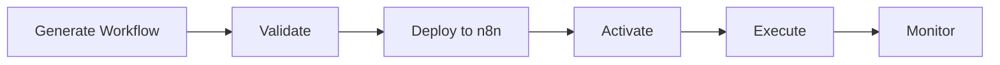
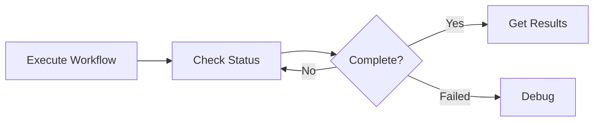

# n8n MCP Usage Examples

Practical examples for using n8n workflows through the MCP integration.

## Prerequisites

1. MCP server configured (see [../MCP_SETUP.md](../MCP_SETUP.md))
2. n8n instance running and accessible
3. Claude Code with MCP integration enabled

## Examples

### [01-execute-workflow.md](01-execute-workflow.md)
**Execute Existing Workflows**

Learn how to:
- List available workflows
- Execute workflows with parameters
- Monitor execution status
- Retrieve results
- Handle errors

**Use when:** You have pre-built workflows in n8n and want to run them.

---

### [02-deploy-workflow.md](02-deploy-workflow.md)
**Deploy Generated Workflows**

Learn how to:
- Generate workflows using Python scripts
- Validate workflows for anti-patterns
- Deploy to n8n via MCP
- Activate workflows
- Test deployments

**Use when:** You need to create custom workflows programmatically.

---

### [03-monitor-executions.md](03-monitor-executions.md)
**Monitor and Debug Executions**

Learn how to:
- Monitor long-running executions
- Debug failed workflows
- Analyze execution performance
- Identify bottlenecks
- Stop runaway executions

**Use when:** You need to troubleshoot or optimize workflows.

---

## Quick Start

### Example 1: Run a Simple Workflow

```
User: List my n8n workflows

Claude: [Shows list of workflows]

User: Execute "Data Sync" workflow

Claude: [Executes workflow and shows status]
```

### Example 2: Deploy Custom Workflow

```
User: Create a book series workflow with 3 books and 10 chapters each

Claude:
- Generating workflow structure...
- Validating for anti-patterns...
- Deploying to n8n...
- Activating workflow...
- Testing execution...
✓ Complete!
```

### Example 3: Debug a Failure

```
User: Why did execution exec_123 fail?

Claude:
Execution failed at node "Generate Content"
Error: API rate limit exceeded
[Shows detailed analysis and recommendations]
```

## Common Patterns

### Pattern 1: Generate → Validate → Deploy → Execute



### Pattern 2: Execute → Monitor → Analyze



## Conversation Templates

### Template: Execute Workflow

```
User: Execute workflow [NAME] with [PARAMETERS]

Expected flow:
1. Claude confirms workflow exists
2. Claude executes with provided data
3. Claude returns execution ID
4. User can monitor progress
```

### Template: Deploy Workflow

```
User: Create a workflow that [DESCRIPTION]

Expected flow:
1. Claude generates workflow structure
2. Claude validates for issues
3. Claude deploys to n8n
4. Claude activates workflow
5. Claude runs test execution
```

### Template: Debug Execution

```
User: Why did execution [ID] fail?

Expected flow:
1. Claude retrieves execution details
2. Claude identifies failure point
3. Claude analyzes error
4. Claude provides recommendations
```

## Best Practices

1. **Always validate** generated workflows before deployment
2. **Test with small data** first (1-3 items)
3. **Monitor long executions** regularly
4. **Use Data Tables** for state management
5. **Follow anti-patterns guide** when building workflows

## Troubleshooting

### "MCP tools not available"
→ Check MCP configuration in `.mcp.json`
→ Restart Claude Code

### "Workflow not found"
→ Verify workflow ID is correct
→ Check if workflow is in your n8n instance

### "Execution timeout"
→ Workflow may be too complex
→ Check n8n server logs
→ Consider breaking into sub-workflows

## Related Documentation

- [SKILL.md](../SKILL.md) - Main skill documentation
- [MCP_SETUP.md](../MCP_SETUP.md) - MCP configuration guide
- [references/anti-patterns.md](../references/anti-patterns.md) - What NOT to do
- [references/known-issues.md](../references/known-issues.md) - Known n8n issues
